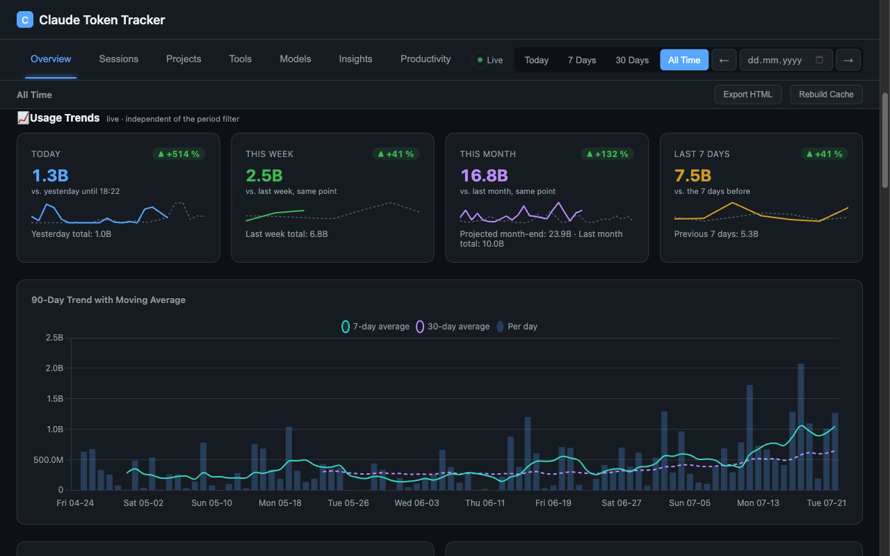
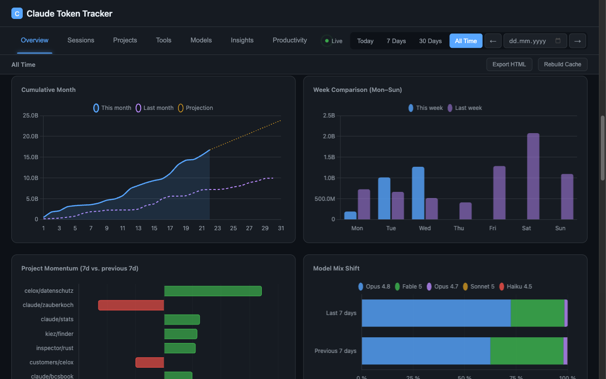
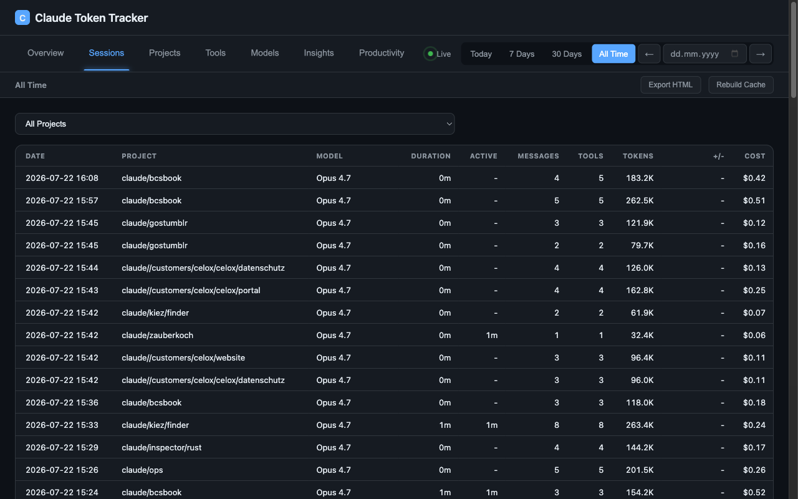
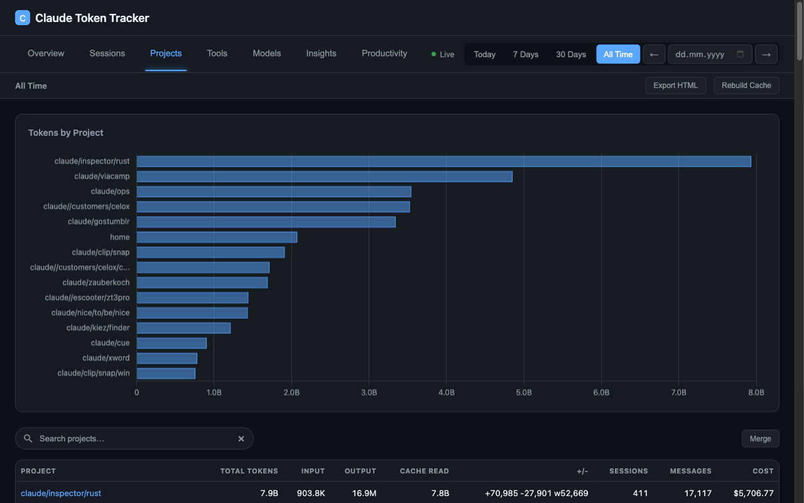
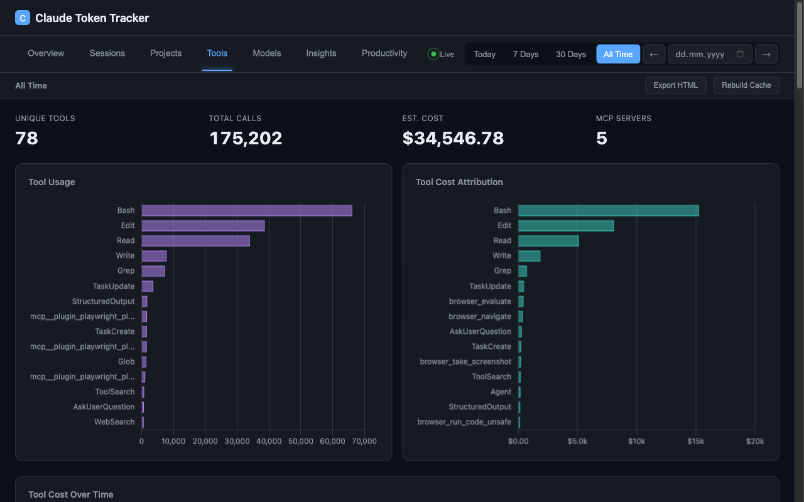
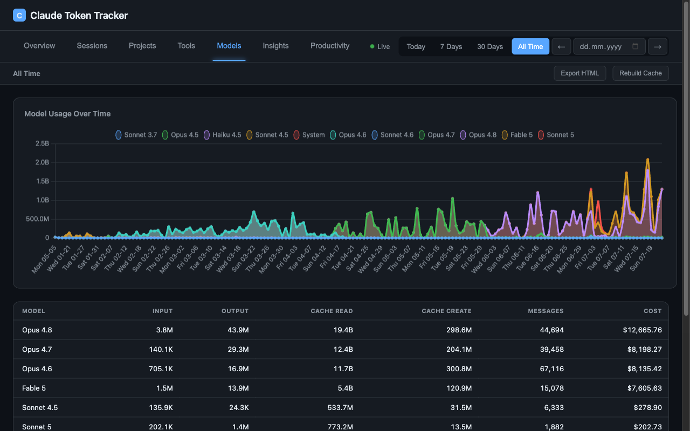
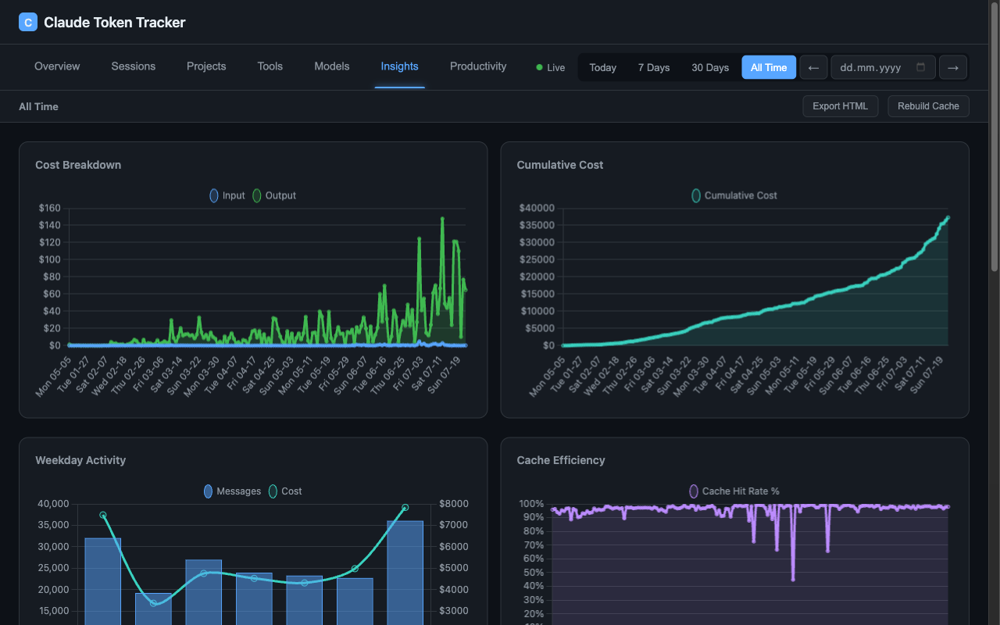
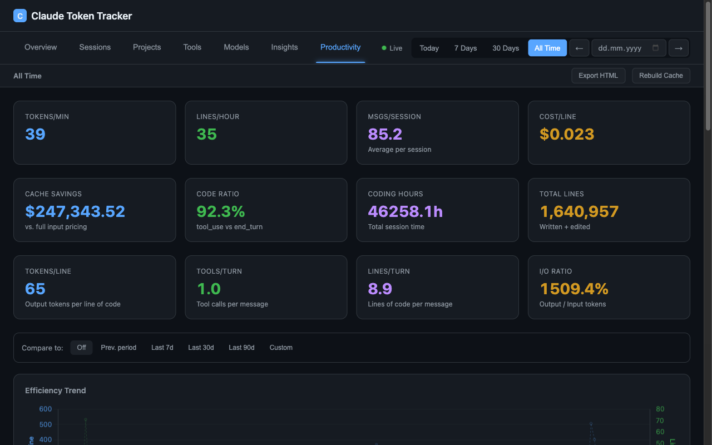
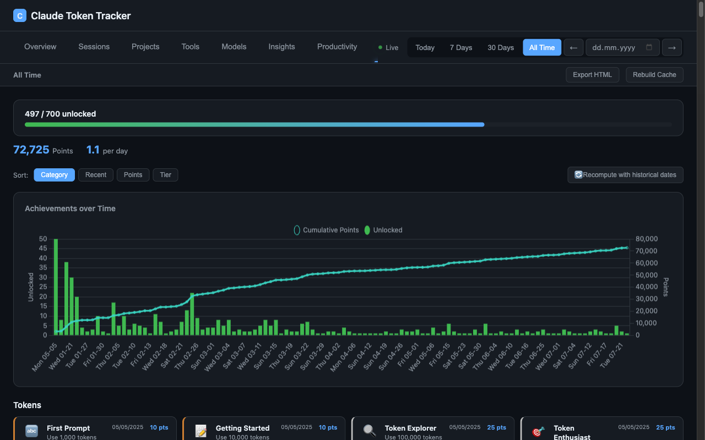

<p align="center">
  
</p>

<h1 align="center">Claude Token Tracker</h1>

<p align="center">
  Real-time dashboard for Claude Code token usage, API-equivalent cost estimation, and coding activity tracking.
</p>

<!-- BADGES:START -->
<p align="center">
  
  
</p>
<!-- BADGES:END -->

<p align="center">
  <a href="https://github.com/pepperonas/claude-token-tracker/actions/workflows/ci.yml"></a>
  <a href="LICENSE"></a>
  <a href="https://github.com/pepperonas/claude-token-tracker/releases"></a>
  <a href="https://github.com/pepperonas/claude-token-tracker/pulls"></a>
  <a href="https://tracker.celox.io"></a>
</p>

<p align="center">
  = 20.12">
  
  
  
</p>

<p align="center">
  
  
  
  
  
</p>

<p align="center">
  
  
  
  
</p>

<p align="center">
  
  
  
  
</p>

<p align="center">
  
  
  
  
  
</p>

<p align="center">
  
  
  
  
  
</p>

<p align="center">
  
  
  
  
  
</p>

<p align="center">
  
  
  
  
  
</p>

<p align="center">
  
  
  
  
  
</p>

<p align="center">
  
  
  
  
  
</p>

<p align="center">
  
  
  
  
  
</p>

<p align="center">
  <a href="https://www.paypal.com/donate/?business=martinpaush@gmail.com&currency_code=EUR"></a>
</p>

---

<p align="center">
  <a href="README_DE.md"></a>
  &nbsp;&nbsp;
  <a href="README_EN.md"></a>
</p>

---

## Quick Start

```bash
git clone https://github.com/pepperonas/claude-token-tracker.git
cd claude-token-tracker
npm install
npm start
```

Open [http://localhost:5010](http://localhost:5010)

## Highlights

- **40+ interactive charts** across 10 tabs with real-time SSE updates
- **Claude API tab** — Anthropic Admin API usage/cost dashboard: budget tracking with progress bar, 4 KPIs (total cost, tokens, avg cost/day, cache efficiency), daily cost/token charts by model, model distribution doughnut, cumulative cost trend. **Per-API-key breakdown**: horizontal stacked bar chart showing cost per key by model, daily cost timeline per key, key comparison table (tokens, input, output, cache %, calculated cost, last used), token history timeline (stacked area). Costs per key calculated via model pricing since the cost API doesn't support `group_by api_key_id`. Key names resolved via `/v1/organizations/api_keys`. AES-256-GCM encrypted key storage, SWR caching with configurable TTL
- **Usage trends** — four live cards (today / this week / this month / last 7 days) comparing against the previous period **cut off at the same point in time** (yesterday up to this hour, last week up to this weekday+time, last month up to this day-of-month, clamped for shorter months), each with a delta badge, overlay sparkline and month-end projection. Below them five comparison charts on the same payload: 90-day volume with 7d/30d moving averages, cumulative month vs. previous month, week comparison Mon–Sun, project momentum (last 7 days vs. the 7 before) and model-mix shift as 100 % stacked bars. Independent of the period filter, honours the cache and token↔cost toggles
- **GitHub Integration** — SWR caching, billing with plan detection & percentages, code statistics (LOC by repo), PR Code Impact, Actions Usage by Repository, contribution heatmap
- **Tool Cost Attribution** — proportional cost/token distribution per tool, MCP server breakdown (auto-detected via `mcp__` prefix), sub-agent tracking (via `/subagents/` path), cost-over-time chart, enhanced table with Type/Cost/Tokens columns
- **Project Detail Dialog** — click any project in chart or table to open a detail modal with 6 KPIs (tokens, cost, sessions, messages, total time, net lines), daily token chart, model distribution doughnut, top tools, sessions list, and JSON export to clipboard
- **Project search & merge** — live substring filter over the Projects table, plus non-destructive merging of projects that are the same codebase (renamed/moved or synced from another device under a different path) into one canonical name, with a 🪄 suggestions button that auto-detects likely duplicates from path names
- **Rate-Limit Tracking** — automatic detection of Claude Code rate-limit events from JSONL logs, daily aggregation, KPI card, backfill for historical data
- **Period navigation** — prev/next arrows beside date picker jump by selected period duration
- **Productivity tab** — Tokens/Min, Lines/Hour, Cost/Line, Cache Savings, Code Ratio with trend indicators
- **Period comparison** — inline pill selector (Off / Prev. Period / Last 7d / 30d / 90d / Custom) compares two periods side-by-side with 8 metrics, delta %, and color-coded indicators
- **HTML export** — mobile-responsive interactive snapshot with Chart.js, 8 tabs, 12+ charts, and sortable tables. Optimized for phones (412px+) with adaptive layouts
- **Global comparison** — compare your stats against the average of all users (multi-user mode)
- **700 achievements** — gamification system across 14 categories with 5 tiers, tier-based points, timeline chart, daily unlock stats, and real-time unlock notifications via SSE
- **Lines of Code tracking** — Write (green), Edit (yellow), Delete (red) with adaptive hourly/daily chart
- **Usage heatmap** — weekday × hour grid in the overview showing token-usage intensity (rows Mon→Sun for multi-day ranges, a single 24-hour strip for one day), cache-toggle aware with per-cell tooltips
- **Weekday-aware dates** — chart axis labels and the period-range header show the weekday (e.g. `Sa 06-27`, `Thu 05/28/2026 – Sat 06/27/2026`)
- **Multi-device tracking** — track usage across multiple machines (MacBook, VPS, Desktop), per-device API keys, device switcher in dashboard, aggregated "All Devices" view, click-to-rename devices, OS-selectable install commands
- **Multi-user mode** — GitHub OAuth, per-user data isolation, Sync Agent with one-click install (macOS/Linux/Windows)
- **Token breakdown** — Input, Output, Cache Read, Cache Create with per-type API-equivalent cost estimation
- **Share API** — secure external API for sharing project-specific token usage data with clients. Share tokens (48-char hex, 192-bit entropy) expose sanitized project data (tokens, cost, sessions, code lines, daily breakdown) via public endpoints. Admin key authentication for share management, rate limiting (30 req/min/IP), CORS restrictions, and optional expiry. Used by [OPS](https://github.com/pepperonas/celox-ops) for customer transparency dashboards. Settings UI shows Share Admin Key with copy button.
- **Database download** — download the full SQLite database from Settings for local backup or analysis
- **333 automated tests** — unit, integration, and multi-user API tests
- **Zero-framework frontend** — vanilla JS, 2 runtime dependencies, no build step

## Screenshots

| | |
|---|---|
|  |  |
| **Overview** — live sessions, KPI cards, token breakdown, active work time | **Usage trends** — today / week / month / rolling 7d vs. the previous period at the same point, plus the 90-day trend with moving averages |
|  |  |
| **Trend comparisons** — cumulative month vs. previous month, week comparison, project momentum, model-mix shift | **Sessions** — sortable table with project, model, duration, active time, tokens, cost |
|  |  |
| **Projects** — per-project tokens and cost, live search, non-destructive merge | **Tools** — tool cost attribution, MCP server breakdown, sub-agent tracking |
|  |  |
| **Models** — model usage over time, per-model tokens and cost | **Insights** — cost breakdown, cumulative cost, weekday activity, cache efficiency |
|  |  |
| **Productivity** — efficiency metrics with period comparison | **Achievements** — 700 achievements across 14 categories, unlocked with historical dates |

### Mobile (iPhone 16 — 393px)

| | | | | |
|---|---|---|---|---|
|  |  |  |  |  |
| **Overview** | **Trends** | **Insights** | **Productivity** | **Achievements** |

## Architecture

```
~/.claude/projects/**/*.jsonl
    -> Parser (incremental byte-offset, dedup by message ID)
    -> SQLite (WAL mode, 10 tables)
    -> Aggregator (in-memory pre-computed maps)
    -> HTTP Server (50+ JSON endpoints + SSE)
    -> Frontend (Chart.js, vanilla JS, i18n DE/EN)
```

**Multi-user mode:**
```
Sync Agent (client) -> POST /api/sync (API key auth)
    -> Per-user SQLite storage
    -> AggregatorCache (lazy loaded, incremental sync, 30min eviction)
    -> GitHub OAuth sessions
```

**Share API (external integration):**
```
OPS -> POST /api/shares (admin key auth) -> project_shares table
Customer browser -> GET /api/public/share/:token -> sanitized project data
```

## Tech Stack

| Layer | Technology |
|---|---|
| **Runtime** | Node.js >= 20.12 (native HTTP server, no Express) |
| **Database** | SQLite via better-sqlite3 (WAL mode, transactions) |
| **Frontend** | Vanilla JS + HTML5 + CSS3 (no build step) |
| **Charts** | Chart.js 4.x |
| **File watching** | Chokidar 4.x |
| **Auth** | GitHub OAuth + HttpOnly session cookies |
| **Encryption** | AES-256-GCM (admin API keys) |
| **Testing** | Vitest + Supertest |
| **Linting** | ESLint 9 (flat config) |
| **CI** | GitHub Actions |

## Share API

### Endpoints

| Endpoint | Auth | Description |
|----------|------|-------------|
| GET /api/share-admin-key | Session | Get admin key + base URL (settings UI) |
| POST /api/share-admin-key | Session | Regenerate admin key |
| GET /api/shares | Admin Key / Session | List all shares |
| POST /api/shares | Admin Key / Session | Create share { project, label, expires_in_days } |
| DELETE /api/shares/:id | Admin Key / Session | Revoke a share |
| GET /api/shares/projects | Admin Key / Session | List projects with stats |
| GET /api/public/share/:token | Public | Get project data (rate limited) |

### Security

- Share tokens: 48-char hex (24 bytes / 192-bit cryptographic randomness)
- Admin key: 64-char hex, stored in .env, required for management endpoints
- Rate limiting: 30 requests/minute per IP on public endpoint
- CORS: restricted to configured origins (ops.celox.io, tracker.celox.io)
- No internal paths exposed, no project enumeration possible
- Optional expiry dates on share tokens

### Setup

```bash
# Add to .env
SHARE_ADMIN_KEY=your-64-char-hex-key
# Or generate in Settings -> Share API -> "Neu generieren"
```

### Integration with OPS

1. Open Token Tracker -> Settings -> Share API
2. Copy Tracker URL and Share Admin Key
3. Add to OPS .env: TOKEN_TRACKER_BASE_URL and TOKEN_TRACKER_ADMIN_KEY
4. In OPS: Edit customer -> "Projekt verknuepfen" -> select project
5. Customer detail page shows KI-Nutzung tab with charts, costs, and sessions

### Public Response Format

```json
{
  "label": "Project Label",
  "summary": { "total_cost", "total_sessions", "lines_written", "..." },
  "daily": [{ "date", "messages", "cost", "lines_written", "..." }],
  "sessions": [{ "start", "end", "duration_min", "cost", "model", "..." }]
}
```

## Data Continuity & Restore

`~/.claude/projects` JSONL is only a **rolling window** — Claude Code prunes old
session files, so the tracker's SQLite DB (`data/tracker.db`) is the long-term
store of the full history. Continuity across devices and reinstalls:

- **Hosted (multi-user)**: the sync agent pushes every message to the server;
  after a machine reset, install the sync agent with a device key from
  Settings and the same account keeps counting — old history stays intact.
- **Local backups**: set `BACKUP_PATH` (+ optional `BACKUP_INTERVAL_HOURS`) —
  atomic `VACUUM INTO` snapshots, auto-pruned to 10 copies.
- **Full local restore after a reset**: `bash scripts/restore-from-server.sh`
  pulls a consistent DB snapshot from the hosted server, swaps it in and
  restarts. Local JSONL is re-parsed on top (deduplicated by message id) and
  achievements recompute with historical dates automatically.

## Links

- **Try it**: [tracker.celox.io](https://tracker.celox.io)
- **Author**: [Martin Pfeffer](https://celox.io) | [GitHub](https://github.com/pepperonas)
- **License**: [MIT](LICENSE)

---

<p align="center">
  <b>If you find this project useful, consider supporting its development:</b>
</p>

<p align="center">
  <a href="https://www.paypal.com/donate/?business=martinpaush@gmail.com&currency_code=EUR"></a>
</p>
