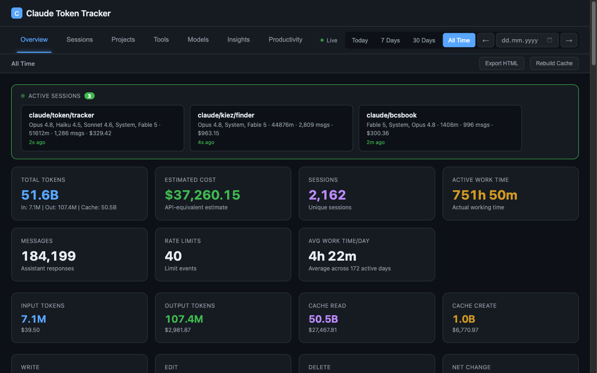
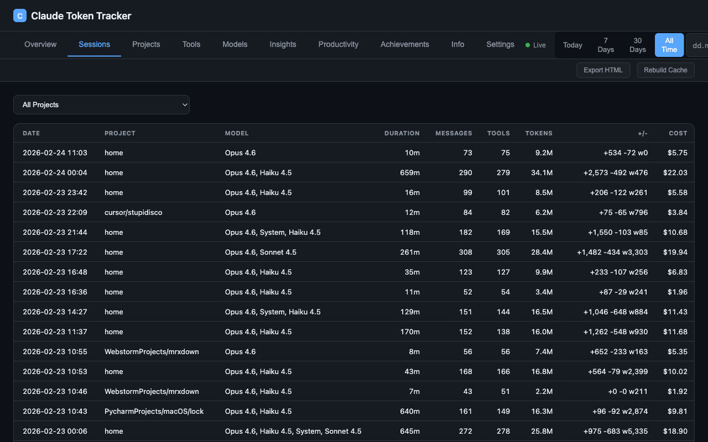
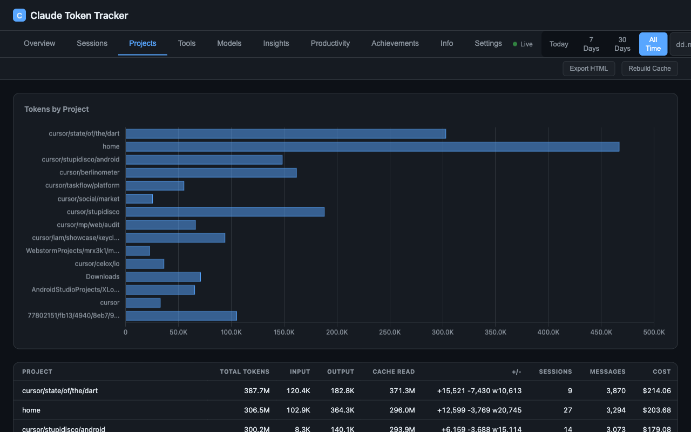
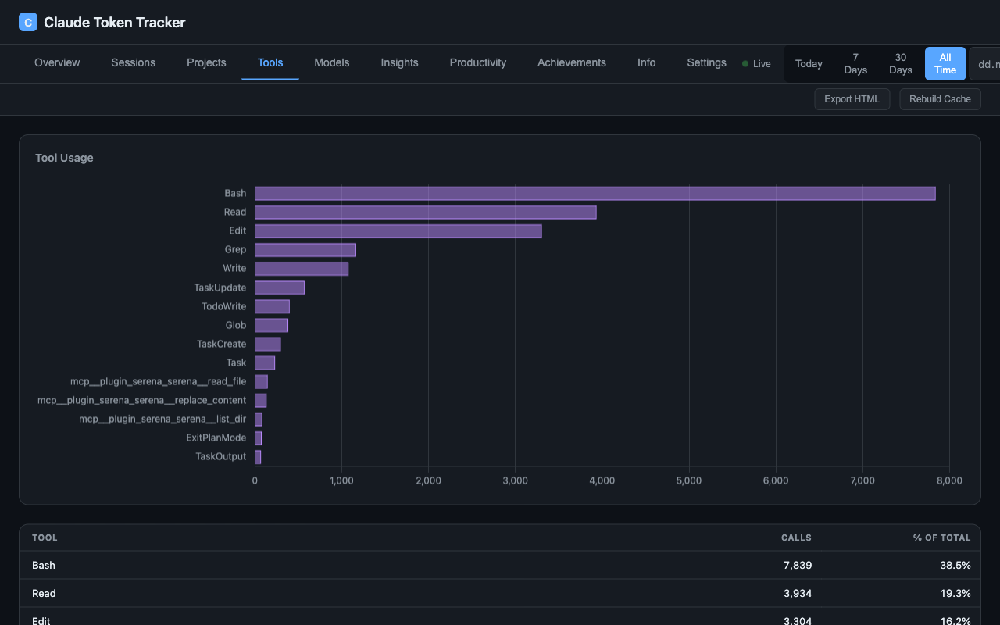
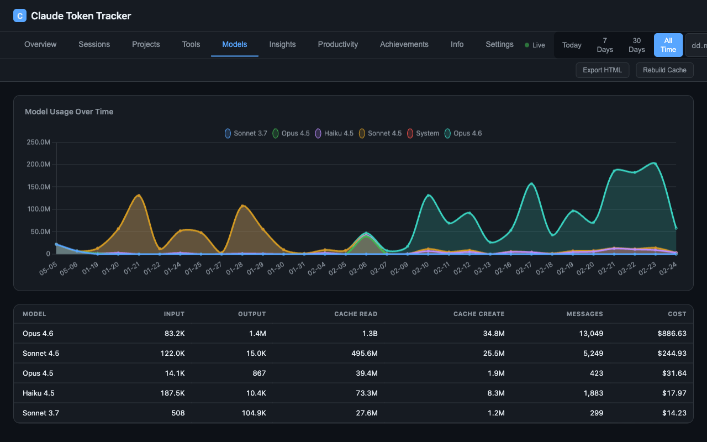
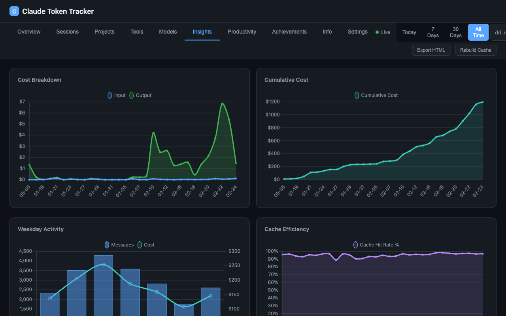
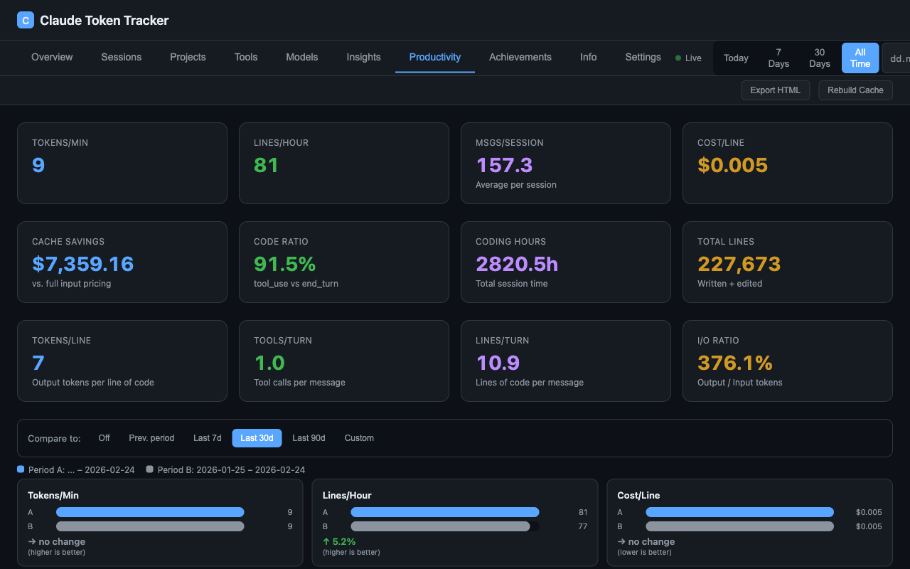
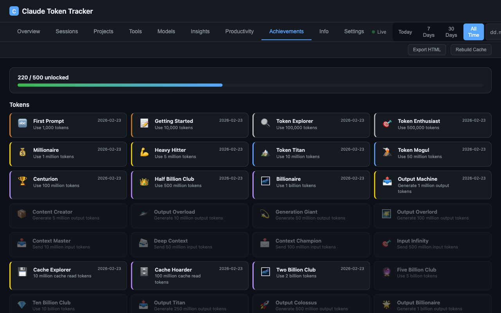

<p align="center">
  
</p>

<h1 align="center">Claude Token Tracker</h1>

<p align="center">
  Real-time dashboard for Claude Code token usage, API-equivalent cost estimation, and coding activity tracking.
</p>

<p align="center">
  <a href="https://github.com/pepperonas/claude-token-tracker/actions/workflows/ci.yml"></a>
  <a href="LICENSE"></a>
  <a href="https://github.com/pepperonas/claude-token-tracker/releases"></a>
  <a href="https://github.com/pepperonas/claude-token-tracker/pulls"></a>
  <a href="https://tracker.celox.io"></a>
</p>

<p align="center">
  = 18">
  
  
  
  
</p>

<p align="center">
  
  
  
  
  
</p>

<p align="center">
  
  
  
  
  
</p>

<p align="center">
  
  
  
  
</p>

<p align="center">
  
  
  
  
  
</p>

<p align="center">
  
  
  
  
  
</p>

<p align="center">
  <a href="https://www.paypal.com/donate/?business=martinpaush@gmail.com&currency_code=EUR"></a>
</p>

---

<p align="center">
  <a href="README_DE.md"></a>
  &nbsp;&nbsp;
  <a href="README_EN.md"></a>
</p>

---

## Quick Start

```bash
git clone https://github.com/pepperonas/claude-token-tracker.git
cd claude-token-tracker
npm install
npm start
```

Open [http://localhost:5010](http://localhost:5010)

## Highlights

- **25+ interactive charts** across 10 tabs with real-time SSE updates
- **Claude API tab** — Anthropic Admin API usage/cost dashboard: budget tracking with progress bar, 4 KPIs (total cost, tokens, avg cost/day, cache efficiency), daily cost/token charts by model, model distribution doughnut, cumulative cost trend. **Per-API-key breakdown**: horizontal stacked bar chart showing cost per key by model, daily cost timeline per key, key comparison table (tokens, input, output, cache %, calculated cost, last used), token history timeline (stacked area). Costs per key calculated via model pricing since the cost API doesn't support `group_by api_key_id`. Key names resolved via `/v1/organizations/api_keys`. AES-256-GCM encrypted key storage, SWR caching with configurable TTL
- **GitHub Integration** — SWR caching, billing with plan detection & percentages, code statistics (LOC by repo), PR Code Impact, Actions Usage by Repository, contribution heatmap
- **Tool Cost Attribution** — proportional cost/token distribution per tool, MCP server breakdown (auto-detected via `mcp__` prefix), sub-agent tracking (via `/subagents/` path), cost-over-time chart, enhanced table with Type/Cost/Tokens columns
- **Rate-Limit Tracking** — automatic detection of Claude Code rate-limit events from JSONL logs, daily aggregation, KPI card, backfill for historical data
- **Period navigation** — prev/next arrows beside date picker jump by selected period duration
- **Productivity tab** — Tokens/Min, Lines/Hour, Cost/Line, Cache Savings, Code Ratio with trend indicators
- **Period comparison** — inline pill selector (Off / Prev. Period / Last 7d / 30d / 90d / Custom) compares two periods side-by-side with 8 metrics, delta %, and color-coded indicators
- **HTML export** — mobile-responsive interactive snapshot with Chart.js, 8 tabs, 12+ charts, and sortable tables. Optimized for phones (412px+) with adaptive layouts
- **Global comparison** — compare your stats against the average of all users (multi-user mode)
- **700 achievements** — gamification system across 14 categories with 5 tiers, tier-based points, timeline chart, daily unlock stats, and real-time unlock notifications via SSE
- **Lines of Code tracking** — Write (green), Edit (yellow), Delete (red) with adaptive hourly/daily chart
- **Multi-user mode** — GitHub OAuth, per-user data isolation, Sync Agent with one-click install (macOS/Linux/Windows)
- **Token breakdown** — Input, Output, Cache Read, Cache Create with per-type API-equivalent cost estimation
- **151 automated tests** — unit, integration, and multi-user API tests
- **Zero-framework frontend** — vanilla JS, 2 runtime dependencies, no build step

## Screenshots

| | |
|---|---|
|  |  |
| **Overview** — KPI cards, token breakdown, lines of code, daily charts | **Sessions** — sortable table with project, model, duration, tokens, cost |
|  |  |
| **Projects** — per-project statistics and cost breakdown | **Tools** — tool cost attribution, MCP server breakdown, sub-agent tracking |
|  |  |
| **Models** — model usage, daily tokens by model, cost breakdown | **Insights** — cache efficiency, stop reasons, lines of code chart |
|  |  |
| **Productivity** — efficiency metrics with period comparison | **Achievements** — 700 achievements across 14 categories with 5 tiers |

### Mobile (iPhone 16 — 393px)

| | | | |
|---|---|---|---|
|  |  |  |  |
| **Overview** | **Insights** | **Productivity** | **Achievements** |

## Architecture

```
~/.claude/projects/**/*.jsonl
    -> Parser (incremental byte-offset, dedup by message ID)
    -> SQLite (WAL mode, 8 tables)
    -> Aggregator (in-memory pre-computed maps)
    -> HTTP Server (50+ JSON endpoints + SSE)
    -> Frontend (Chart.js, vanilla JS, i18n DE/EN)
```

**Multi-user mode:**
```
Sync Agent (client) -> POST /api/sync (API key auth)
    -> Per-user SQLite storage
    -> AggregatorCache (lazy loaded, 30min eviction)
    -> GitHub OAuth sessions
```

## Tech Stack

| Layer | Technology |
|---|---|
| **Runtime** | Node.js >= 18 (native HTTP server, no Express) |
| **Database** | SQLite via better-sqlite3 (WAL mode, transactions) |
| **Frontend** | Vanilla JS + HTML5 + CSS3 (no build step) |
| **Charts** | Chart.js 4.x |
| **File watching** | Chokidar 4.x |
| **Auth** | GitHub OAuth + HttpOnly session cookies |
| **Encryption** | AES-256-GCM (admin API keys) |
| **Testing** | Vitest + Supertest |
| **Linting** | ESLint 9 (flat config) |
| **CI** | GitHub Actions |

## Links

- **Try it**: [tracker.celox.io](https://tracker.celox.io)
- **Author**: [Martin Pfeffer](https://celox.io) | [GitHub](https://github.com/pepperonas)
- **License**: [MIT](LICENSE)

---

<p align="center">
  <b>If you find this project useful, consider supporting its development:</b>
</p>

<p align="center">
  <a href="https://www.paypal.com/donate/?business=martinpaush@gmail.com&currency_code=EUR"></a>
</p>
