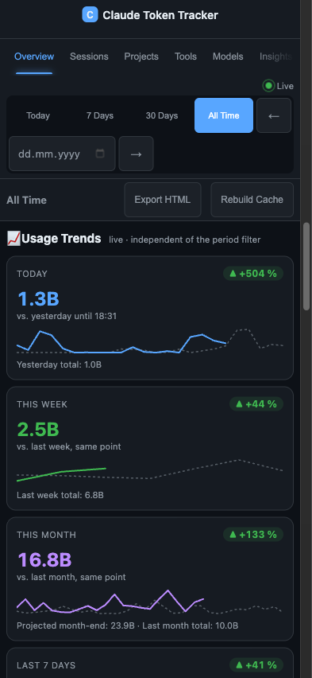

<p align="center">
  <a href="README_EN.md"></a>
</p>

<p align="center">
  <a href="https://github.com/pepperonas/claude-token-tracker/actions/workflows/ci.yml"></a>
  <a href="LICENSE"></a>
  <a href="https://github.com/pepperonas/claude-token-tracker/releases"></a>
  <a href="https://github.com/pepperonas/claude-token-tracker/pulls"></a>
  <a href="https://tracker.celox.io"></a>
</p>

<p align="center">
  = 20.12">
  
  
  
  
</p>

<p align="center">
  
  
  
  
  
</p>

<p align="center">
  
  
  
  
  
</p>

<p align="center">
  
  
  
  
</p>

<p align="center">
  
  
  
  
  
</p>

<p align="center">
  
  
  
  
  
</p>

<p align="center">
  
  
  
  
  
</p>

<p align="center">
  
  
  
  
  
</p>

<p align="center">
  
  
  
  
  
</p>

<p align="center">
  
  
  
  
  
</p>

<p align="center">
  
  
  
  
  
</p>

<p align="center">
  <a href="https://www.paypal.com/donate/?business=martinpaush@gmail.com&currency_code=EUR"></a>
</p>

---

<p align="center">
  
</p>

# Claude Token Tracker

Dashboard zur Analyse deiner Claude Code Token-Nutzung. Liest die JSONL-Sitzungsdateien von Claude Code, schätzt API-äquivalente Kosten, trackt Codezeilen und zeigt alles in Echtzeit an. Unterstützt **Single-User** (lokal) und **Multi-User** (gehostet mit GitHub OAuth + Sync Agent).

> **Hinweis zu Kosten:** Claude Code wird als Flatrate-Abo (Pro-/Max-Plan) abgerechnet, nicht pro Token. Die im Dashboard angezeigten Kosten sind **API-äquivalente Schätzungen** — sie zeigen, was deine Token-Nutzung zu regulären Anthropic-API-Preisen kosten würde. Das ist nützlich, um relative Nutzungsmuster zu verstehen, Effizienz über Sessions hinweg zu vergleichen und den Wert deines Abonnements einzuschätzen.

## Features

### Dashboard & Visualisierung

- **25+ interaktive Charts** über 10 Tabs (Übersicht, Sitzungen, Projekte, Tools, Modelle, Insights, Produktivität, Achievements, GitHub, Claude API, Info)
- **Tool-Kostenverteilung** — proportionale Kosten-/Token-Verteilung pro Tool, MCP-Server-Aufschlüsselung (automatisch erkannt über `mcp__`-Präfix), Sub-Agent-Tracking (über `/subagents/`-Pfad), Kosten-Zeitverlauf-Chart, erweiterte Tabelle mit Typ-/Kosten-/Token-Spalten
- **Aktive Sitzungen** — Live-Anzeige aktuell laufender Claude-Code-Sessions mit Projekt, Modell, Dauer und Kosten
- **Token-Aufschlüsselung** — Detail-KPI-Cards für Input, Output, Cache Read und Cache Create Tokens mit Einzelkosten
- **Aktive Arbeitszeit** — tatsächliche Arbeitszeit (Wall-Clock) berechnet aus einer vereinten Message-Timeline im Zeitraum (Lücken > 5 Min. als Pause gewertet). Zusätzliche KPI „Ø Arbeitszeit/Tag" teilt durch Tage mit tatsächlicher Aktivität (nicht durch Zeitraumlänge) — bei 30-Tage-Filter mit nur 15 aktiven Tagen wird durch 15 geteilt
- **Lines of Code** — Write (grün), Edit (gelb), Delete (rot) mit Netto-Änderungsberechnung und adaptivem Stunden-/Tages-Chart
- **Nutzungs-Trends** — vier auf „jetzt“ verankerte Vergleichskarten in der Übersicht (heute / diese Woche / dieser Monat / rollierende 7 Tage), jeweils gegen die Vorperiode **zum gleichen Stand**: gestern bis zu dieser Uhrzeit, letzte Woche bis zu diesem Wochentag+Uhrzeit, Vormonat bis zu diesem Tag im Monat (auf kürzere Monate geclamped). Delta-Badge, Overlay-Sparkline (die laufende Periode endet sichtbar dort, wo sie steht, die Vorperiode gestrichelt), Monatsend-Hochrechnung und Tooltip mit Nachrichten + aktiver Zeit beider Seiten. Darunter fünf Vergleichs-Charts auf **demselben Payload** — 90-Tage-Volumen mit 7-/30-Tage-Schnitt, kumulierter Monat vs. Vormonat, Wochenvergleich Mo–So, Projekt-Momentum (letzte 7 Tage vs. die 7 davor) und Modell-Mix-Verschiebung als 100-%-Stapel. Unabhängig vom Zeitraumfilter, folgt Cache- und Token↔Kosten-Toggle. Geliefert von `GET /api/trends` / `Aggregator.getTrends()` in einem einzigen Message-Scan
- **Nutzungs-Heatmap** — Wochentag × Stunde-Raster in der Übersicht, das die Token-Nutzungsintensität visualisiert. Mehrtages-Zeiträume zeigen ein 7×24-Raster (Zeilen Mo→So); ein Einzeltag zeigt einen 24-Stunden-Streifen. Cache-Toggle-bewusst, mit Tooltip pro Zelle (Tokens · Nachrichten · Kosten). Leichtgewichtiges CSS-Grid (keine Extra-Abhängigkeit), geliefert von `GET /api/hourly-weekday` / `Aggregator.getHourlyWeekday()`
- **Wochentag-bewusste Daten** — Diagramm-Achsenbeschriftungen tragen den Wochentag (`Sa 06-27`) und ein Zeitraum-Header zeigt das gewählte Fenster mit Wochentagen (`Do 28.05.2026 – Sa 27.06.2026`)
- **Globaler Zeitraumfilter** — Heute / 7 Tage / 30 Tage / Gesamt mit Vor-/Zurück-Navigationspfeilen, wirkt auf alle Tabs
- **Datenbank-Download** — SQLite-Datenbank direkt aus den Einstellungen herunterladen für lokales Backup oder Analyse
- **Sortierbare Tabellen** — Alle Datentabellen durch Klick auf Spaltenüberschriften sortierbar
- **Projekt-Detail-Dialog** — Projekte in Chart oder Tabelle anklicken öffnet ein Detail-Modal mit 6 KPIs (Tokens, Kosten, Sessions, Nachrichten, Gesamtdauer, Netto-Zeilen), täglichem Token-Chart, Modellverteilungs-Doughnut, Top-Tools, Session-Liste und JSON-Export in die Zwischenablage
- **Projekt-Suche** — Live-Teilstring-Filter über der Projekt-Tabelle mit Trefferanzahl und Löschen-Button
- **Projekte zusammenführen** — Projekte, die dieselbe Codebase sind (umbenannt/verschoben oder von einem anderen Gerät unter anderem Pfad synchronisiert), unter einem kanonischen Namen zusammenfassen. Nicht-destruktiv (Originale bleiben, Zusammenführung jederzeit umkehrbar) und zur Lesezeit angewandt, übersteht also Re-Parses und künftige Syncs. Inklusive 🪄 **Vorschlägen**, die wahrscheinliche Dubletten aus den Pfadnamen automatisch erkennen, und einem „+n zusammengeführt"-Badge an kombinierten Projekten
- **CSS-only Tooltips** mit Erklärungen auf KPI-Labels und Chart-Titeln
- **Chart-Legenden-Persistenz** — Legenden-Auswahl und Zeitraumfilter werden im localStorage gespeichert
- **Mobil-optimiert** — optimiert für Smartphones (ab 393px) mit Touch-Targets, adaptiven Charts und kompaktem Layout
- **Zweisprachige UI** (Deutsch / Englisch) mit Tab-, Zeitraum- und Einstellungspersistenz

### GitHub-Integration

- **GitHub-Tab** — Verbindung über Personal Access Token für GitHub-spezifische Analysen
- **Stale-While-Revalidate Caching** — gecachte Daten werden sofort ausgeliefert (auch wenn abgelaufen), Hintergrund-Refresh mit Doppel-Fetch-Verhinderung. 60-Min-TTL, manueller Refresh-Button verfügbar. Nach dem ersten Laden zeigt der GitHub-Tab nie einen Spinner
- **Billing-Übersicht** — Actions-Minuten, Packages, Storage mit Free/Pro-Plan-Erkennung, Fortschrittsbalken und Prozentanzeige
- **Code-Statistiken** — LOC hinzugefügt/gelöscht/netto aggregiert über die Top-10-Repos via GitHub Code Frequency API, zeitraumgefiltert
- **PR Code Impact** — Additions (grün), Deletions (rot), Netto-Zeilen und geänderte Dateien über alle PRs mit gruppiertem Balkendiagramm nach PR-Status (Merged/Open/Closed). Zeigt „gesamt"-Hinweis bei aktivem Zeitraumfilter (PR-Daten können nicht nach Datum gefiltert werden)
- **Actions-Nutzung pro Repository** — horizontales Balkendiagramm der abrechnungsfähigen Minuten pro Repo (Top 15), Workflow-Aufschlüsselung mit OS-Billing-Multiplikatoren (Ubuntu 1x, macOS 10x, Windows 2x)
- **Minuten nach Runner-OS** — Doughnut-Chart der Actions-Minuten-Verteilung über Ubuntu, macOS und Windows Runner
- **Contributions & Repos** — Contributions-Heatmap (immer volles Jahr), Commit-Chart und KPIs gefiltert nach gewähltem Zeitraum
- **Lazy Loading** — schnelle Daten (Stats + Billing) werden sofort angezeigt, langsame Daten (Actions-Nutzung, Code-Statistiken) laden im Hintergrund nach
- **Sanfter Refresh** — Zeitraumwechsel und Refresh-Button aktualisieren Daten ohne Spinner oder Scroll-Sprung

### Claude API Integration

- **Anthropic Admin API Dashboard** — Verbindung über Admin Key (`sk-ant-admin`) für organisationsweite Nutzungs- und Kostendaten der Anthropic API
- **4 KPIs** — Gesamtkosten, Tokens gesamt, Ø Kosten/Tag (an aktiven Tagen), Cache-Effizienz (Cache-Read-Anteil)
- **Budget-Tracking** — monatliches Budget mit Fortschrittsbalken, farbcodierte Schwellenwerte (grün < 70%, orange < 90%, rot >= 90%)
- **Tägliche Kosten** — gestapeltes Balkendiagramm der täglichen Kosten nach Modell (Opus, Sonnet, Haiku)
- **Tägliche Tokens** — gestapeltes Balkendiagramm der täglichen Tokens nach Typ (Input, Output, Cache Read, Cache Create)
- **Modell-Verteilung** — Doughnut-Chart der Kostenanteile pro Modell
- **Kumulativer Kosten-Trend** — Liniendiagramm der laufenden Gesamtkosten
- **Kosten pro API Key** — horizontales gestapeltes Balkendiagramm der berechneten Kosten pro API Key, aufgeschlüsselt nach Modell. Kosten berechnet über `lib/pricing.js` Modellpreise (die Anthropic Cost-API unterstützt kein `group_by api_key_id`)
- **Tägliche Kosten pro Key** — gestapeltes Balkendiagramm der täglichen Kosten pro API Key im Zeitverlauf
- **API Key Vergleichstabelle** — sortierbare Tabelle mit Spalten: Key-Name, Tokens, Input, Output, Cache %, berechnete Kosten, letzter Aufruf
- **Token-Verlauf pro Key** — gestapeltes Flächendiagramm der täglichen Tokens pro Key (nur bei mehr als einem Key sichtbar)
- **Key-Namensauflösung** — API Key IDs werden über `/v1/organizations/api_keys` in lesbare Namen aufgelöst, mit gekürzter ID als Fallback
- **AES-256-GCM Verschlüsselung** — Admin Keys verschlüsselt in der Datenbank gespeichert, werden nie im Klartext zurückgegeben
- **Stale-While-Revalidate Caching** — API-Antworten gecacht mit konfigurierbarem TTL (`ANTHROPIC_CACHE_TTL_MINUTES`, Standard 60 Min), manueller Refresh-Button mit Cache-Alter-Anzeige
- **Zeitraum-Filterung** — alle Tages-Charts und KPIs respektieren den globalen Zeitraumfilter (Heute / 7T / 30T / Gesamt)
- **Multi-User Support** — jeder User speichert seinen eigenen Admin Key; im Single-User-Modus kann der Key via `.env` oder in den Einstellungen gesetzt werden

### Datenverarbeitung

- **Inkrementelles Parsing** — nur neue Daten werden verarbeitet (Byte-Offset-Tracking)
- **SQLite-Datenbank** mit WAL-Modus für persistente Speicherung und schnelle Abfragen
- **In-Memory Aggregation** — vorberechnete Maps für schnelle API-Antworten, inkrementelle Cache-Updates beim Sync (kein vollständiger Rebuild)
- **Echtzeit-Updates** via Server-Sent Events (animationsfrei bei Live-Updates)
- **API-äquivalente Kostenschätzung** für alle Claude-Modelle (Opus 4.5/4.6, Sonnet 4.5, Haiku 4.5, Sonnet 3.7) — zeigt, was die Nutzung zu regulären API-Preisen kosten würde, nicht die tatsächliche Abrechnung (Claude Code nutzt ein Flatrate-Abo)
- **Automatisches Backup** (konfigurierbar, z.B. in Google Drive)

### Multi-User & Deployment

- **Multi-Device-Tracking** — Nutzung über mehrere Geräte tracken (MacBook, VPS, Desktop), eigene API-Keys pro Gerät, Geräte-Umschalter im Dashboard, aggregierte „Alle Geräte"-Ansicht, Klick-zum-Umbenennen, OS-wählbare Installations-Befehle
- **Multi-User-Modus** — GitHub OAuth, persönliche API-Keys, Datenisolation pro User
- **Sync Agent** — Ein-Klick-Installation via curl (macOS/Linux) oder PowerShell (Windows), überwacht lokale Sitzungsdateien und überträgt an den Server
- **Autostart** — Install-Script richtet automatisch launchd (macOS), systemd (Linux) oder Task Scheduler (Windows) ein
- **SEO-optimiert** mit Open Graph, Twitter Cards und strukturierten Meta-Tags
- **CI/CD Pipeline** mit GitHub Actions (Lint + Tests)
- **Demo-Modus** — nicht eingeloggte Besucher sehen ein Beispiel-Dashboard; mit GitHub anmelden, um eigene Daten zu sehen
- **700 Achievements** — Gamification-System über 14 Kategorien (Tokens, Sessions, Nachrichten, Kosten, Lines, Modelle, Tools, Zeit, Projekte, Streaks, Cache, Spezial, Effizienz, Rate-Limits) mit 5 Stufen (Bronze bis Diamant), stufenbasierten Punkten (10–250), Zeitverlauf-Chart, täglichen Freischaltungs-Statistiken und Echtzeit-Benachrichtigungen bei neuen Freischaltungen via SSE
- **Produktivitäts-Tab** — Tokens/Min, Zeilen/Stunde, Kosten/Zeile, Cache-Ersparnis, Code-Anteil mit Trend-Indikatoren
- **Perioden-Vergleich** — immer sichtbare Pill-Leiste (Aus / Vorperiode / Letzte 7T / 30T / 90T / Eigener) vergleicht zwei Zeiträume sofort nebeneinander mit 8 Metriken (Tokens/Min, Zeilen/Stunde, Kosten/Zeile, Tokens/Zeile, Zeilen/Nachricht, Tools/Nachricht, I/O-Verhältnis, Coding-Stunden), Delta-Prozenten und farbcodierten Verbesserungs-/Verschlechterungsanzeigen — ein Klick genügt, kein separater Toggle nötig
- **HTML-Export** — mobil-optimierter interaktiver Snapshot mit Chart.js, 8 Tabs (Übersicht, Charts, Sitzungen, Projekte, Modelle, Tools, Produktivität, Achievements), 12+ Charts und sortierbaren Tabellen. Optimiert für Smartphones (412px+) mit adaptiven Layouts, Touch-freundlichen Tabs und responsiven Chart-Darstellungen
- **Globaler Vergleich** — eigene Statistiken gegen den Durchschnitt aller Nutzer vergleichen (Multi-User-Modus)
- **255 automatisierte Tests** (Unit + Integration + Multi-User API + Achievements)

## Mobile Screenshots (iPhone 16 — 393px)

| | | | | |
|---|---|---|---|---|
|  |  |  |  |  |
| **Übersicht** | **Trends** | **Insights** | **Produktivität** | **Achievements** |

## Architektur

```
Single-User:
  ~/.claude/projects/**/*.jsonl
      → Parser (inkrementell, Byte-Offset)
      → SQLite (WAL, 10 Tabellen, INSERT OR REPLACE)
      → Aggregator (In-Memory, vorberechnete Maps)
      → HTTP-Server (50+ JSON-Endpoints + SSE)
      → Frontend (Chart.js, i18n DE/EN, sortierbare Tabellen)

Multi-User:
  Sync Agent (Client) → POST /api/sync (API-Key Auth)
      → SQLite (pro User, user_id)
      → AggregatorCache (lazy, inkrementeller Sync, 30min Eviction)
      → HTTP-Server (GitHub OAuth + Session Cookies)
      → Frontend (Login-Overlay, Sync-Setup, Active Sessions)
```

### Modulübersicht

| Modul | Beschreibung |
|-------|-------------|
| `lib/parser.js` | Liest JSONL-Dateien, extrahiert Token-Zähler, Tools (mit Aufrufzählung pro Tool), Modell, Lines-of-Code und Sub-Agent-Flag aus `type: 'assistant'` Nachrichten |
| `lib/aggregator.js` | In-Memory Analytics-Engine mit `_daily`, `_sessions`, `_projects`, `_models`, `_tools`, `_hourly`, `_toolStats`, `_mcpServers`, `_subagentStats` Maps. `AggregatorCache` unterstützt inkrementelle Updates via `addToUser()` um vollständige Rebuilds beim Sync zu vermeiden |
| `lib/db.js` | SQLite-Schicht mit `messages`, `message_tools`, `parse_state`, `metadata`, `users`, `user_sessions`, `achievements`, `github_cache`, `rate_limit_events`, `devices` Tabellen. Compound-Indexes für Multi-User/Device-Abfragen |
| `lib/pricing.js` | Modellpreise (Input/Output/CacheRead/CacheCreate pro 1M Tokens) |
| `lib/watcher.js` | Chokidar File-Watcher mit debounced inkrementellem Parsing |
| `lib/auth.js` | GitHub OAuth Flow, Session-Management, Cookie-basierte Authentifizierung |
| `lib/backup.js` | SQLite `VACUUM INTO` für atomare Backups, Auto-Pruning auf 10 Kopien, 50%-Größen-Sicherheitscheck |
| `lib/achievements.js` | 700 Achievement-Definitionen mit Check-Logik, Stats-Builder, stufenbasierten Punkten und Unlock-Tracking |
| `lib/github.js` | GitHub-API-Integration (REST + GraphQL), Billing via Usage-Summary-API, PR-Statistiken, Contributions, Code-Statistiken, Actions-Nutzung pro Repo mit OS-Multiplikatoren, Stale-While-Revalidate-Cache (60-Min-TTL) |
| `lib/anthropic-api.js` | Anthropic Admin API Integration — Usage/Cost-Reports, Per-API-Key-Aufschlüsselung (4 parallele Requests: Usage nach Modell, Usage nach Key+Modell, Cost-Report, API-Key-Namen), SWR-Cache, AES-256-GCM Key-Verschlüsselung |
| `lib/export-html.js` | Mobil-optimierter HTML-Snapshot-Generator mit Chart.js, 8 Tabs, 12+ Charts, sortierbaren Tabellen und responsiven Breakpoints (768px/480px/412px) |
| `server.js` | Vanilla `http.createServer` mit 50+ API-Routen, SSE und statischen Dateien |
| `sync-agent/` | Standalone CLI-Tool für Client-seitiges Watching und Uploading |

## Installation

```bash
git clone https://github.com/pepperonas/claude-token-tracker.git
cd claude-token-tracker
npm install
npm start
```

Dashboard öffnen: [http://localhost:5010](http://localhost:5010)

## Konfiguration

Erstelle eine `.env` Datei (optional für Single-User, erforderlich für Multi-User):

### Allgemein

| Variable | Standard | Beschreibung |
|----------|----------|-------------|
| `PORT` | `5010` | Server-Port |
| `CLAUDE_DIR` | `~/.claude` | Pfad zum Claude-Verzeichnis |
| `DB_PATH` | `data/tracker.db` | Pfad zur SQLite-Datenbank |
| `BACKUP_PATH` | *(leer)* | Zielverzeichnis für automatische Backups |
| `BACKUP_INTERVAL_HOURS` | `6` | Backup-Intervall in Stunden |
| `GITHUB_TOKEN` | — | GitHub Personal Access Token (für GitHub-Tab) |

### Multi-User-Modus

| Variable | Standard | Beschreibung |
|----------|----------|-------------|
| `MULTI_USER` | `false` | Multi-User-Modus aktivieren |
| `BASE_URL` | `http://localhost:PORT` | Öffentliche URL (für OAuth-Redirect) |
| `GITHUB_CLIENT_ID` | — | GitHub OAuth App Client ID |
| `GITHUB_CLIENT_SECRET` | — | GitHub OAuth App Client Secret |
| `SESSION_SECRET` | — | Geheimer Schlüssel für Sessions |

## Lines of Code

Der Tracker erfasst automatisch Codezeilen-Änderungen aus den JSONL-Sitzungsdateien:

- **Write** (grün) — Zeilen in `content` bei Write-Tool-Aufrufen (neue Dateien / Überschreiben)
- **Edit** (gelb) — Zeilen in `new_string` bei Edit-Tool-Aufrufen (Ersetzungstext)
- **Delete** (rot) — Zeilen in `old_string` bei Edit-Tool-Aufrufen (entfernter Text)

**Netto-Änderung** = write + edit - delete

Die Daten werden angezeigt als:
- **KPI-Cards** in der Übersicht (Write, Edit, Delete, Net Change)
- **Spalte "+/-"** in den Sessions- und Projekte-Tabellen
- **Tägliches Balkendiagramm** im Insights-Tab (grün = Write, gelb = Edit, rot = Delete)

> Nach einem **Cache Rebuild** werden alle historischen Dateien neu geparst und die Lines-Daten befüllt.

## Multi-User-Modus

Der Multi-User-Modus ermöglicht es mehreren Personen, ihre Token-Daten auf einem zentralen Server zu tracken.

1. **GitHub OAuth App erstellen** unter [github.com/settings/developers](https://github.com/settings/developers)
   - Authorization callback URL: `https://deine-domain.de/auth/github/callback`
2. **`.env` konfigurieren** mit den OAuth-Credentials und `MULTI_USER=true`
3. **Server starten** — Login via GitHub erscheint automatisch

Jeder User bekommt einen persönlichen **API-Key** für den Sync Agent, einsehbar im Info-Tab.

### Unterschiede zum Single-User-Modus

| Aspekt | Single-User | Multi-User |
|--------|-------------|------------|
| Datenquelle | Lokale JSONL-Dateien (Chokidar-Watcher) | Sync Agent Uploads via API |
| Authentifizierung | Keine | GitHub OAuth + Session Cookies |
| Datenisolation | Keine (alle Daten gehören einem User) | Per-User via `user_id`, per-Gerät via `device_id` |
| Aggregation | Ein globaler Aggregator | AggregatorCache (per-User, per-Gerät, inkrementelle Sync-Updates, 30min Eviction) |
| File Watcher | Aktiv | Deaktiviert |

## Sync Agent

Der Sync Agent läuft auf dem Rechner des Users und überträgt lokale Claude-Code-Sitzungsdaten automatisch an den Server.

### Ein-Klick-Installation (empfohlen)

1. Im Dashboard einloggen → Info-Tab → **Sync Agent einrichten**
2. Betriebssystem wählen (macOS/Linux oder Windows)
3. Den angezeigten Befehl kopieren oder das Install-Script herunterladen

**macOS / Linux:**
```bash
curl -sL "https://deine-domain.de/api/sync-agent/install.sh?key=DEIN_API_KEY" | bash
```

**Windows (PowerShell):**
```powershell
powershell -ExecutionPolicy Bypass -Command "irm 'https://deine-domain.de/api/sync-agent/install.ps1?key=DEIN_API_KEY' | iex"
```

Das Script:
- Prüft Node.js >= 20.12 und npm
- Installiert den Agent nach `~/claude-sync-agent/` (macOS/Linux) bzw. `%USERPROFILE%\claude-sync-agent\` (Windows)
- Konfiguriert API-Key und Server-URL automatisch
- Verifiziert die Server-Verbindung
- Richtet Autostart ein (launchd auf macOS, systemd auf Linux, Task Scheduler auf Windows)
- Startet den Agent sofort

### Manuelle Installation

```bash
cd sync-agent
npm install
node index.js setup    # Server-URL und API-Key eingeben
node index.js          # Starten (Full Sync + Watch)
```

### Autostart mit PM2 (Alternative)

```bash
pm2 start ~/claude-sync-agent/index.js --name claude-sync
pm2 save
```

### Funktionsweise

| Eigenschaft | Wert |
|-------------|------|
| File-Watcher | Chokidar 4.x mit `awaitWriteFinish` Debouncing, pfadbasierte Ignore-Funktion (kompatibel mit Full-Path-Matching) |
| Parsing | Inkrementell (Byte-Offset, nur neue Daten) |
| Batch-Größe | Max. 500 Nachrichten pro Request |
| Retry | Exponential Backoff (3 Versuche) |
| Reaktionszeit | ~600ms nach jeder Claude-Antwort |
| Zustand | Persistiert in `.sync-state.json` |
| Heartbeat | Statusmeldung alle 30 Minuten |
| Fehlerbehandlung | FSEvents-Fehler-Recovery, Unhandled-Rejection-Guard |

## Aktive Sitzungen

Im Übersicht-Tab werden aktive Claude-Code-Sessions live angezeigt (grüne Sektion oberhalb der KPI-Cards). Eine Sitzung gilt als aktiv, wenn die letzte Nachricht innerhalb der letzten 10 Minuten lag. Pro Session werden Projekt, Modell, Dauer, Nachrichten und Kosten angezeigt. Die Anzeige aktualisiert sich automatisch via SSE — ohne Chart-Animationen.

## Backup

| Methode | Befehl |
|---------|--------|
| Automatisch | `BACKUP_PATH` in `.env` setzen (z.B. Google Drive) |
| Manuell | `curl -X POST http://localhost:5010/api/backup` |
| JSON-Export | `curl http://localhost:5010/api/export > export.json` |

- Backups werden beim Start und im konfigurierten Intervall erstellt
- Maximal 10 Backup-Kopien (ältere werden automatisch gelöscht)
- Atomares Backup via SQLite `VACUUM INTO`
- Sicherheitscheck: Backups kleiner als 50% des letzten Backups werden abgelehnt, um korrupte/leere Datenbanken zu verhindern

## Deployment

Beispiel-Deployment mit PM2 + Nginx + SSL:

```bash
# Auf dem Server
git clone https://github.com/pepperonas/claude-token-tracker.git
cd claude-token-tracker
npm ci --production
cp .env.example .env   # Konfigurieren
pm2 start server.js --name token-tracker --node-args='--env-file=.env'
pm2 save
```

Nginx Reverse Proxy mit SSL (certbot) empfohlen für den Multi-User-Modus.

### Hosted Version

Der Tracker läuft produktiv unter [tracker.celox.io](https://tracker.celox.io).

## API-Endpunkte

| Endpunkt | Methode | Beschreibung |
|----------|---------|-------------|
| `/api/overview` | GET | KPI-Daten (Tokens, Kosten, Sessions, Messages, Lines) |
| `/api/daily` | GET | Tägliche Aggregate (Tokens, Kosten, Lines) |
| `/api/sessions` | GET | Alle Sessions mit Filter (Projekt, Modell, Zeitraum) |
| `/api/projects` | GET | Projektstatistiken |
| `/api/models` | GET | Modellstatistiken |
| `/api/tools` | GET | Tool-Nutzungsstatistiken |
| `/api/tool-stats` | GET | Tool-Kostenverteilung (Kosten, Tokens, Typ pro Tool) |
| `/api/mcp-servers` | GET | MCP-Server-Aufschlüsselung mit Per-Tool-Statistiken |
| `/api/subagent-stats` | GET | Sub-Agent Nachrichten-/Token-/Kostenstatistiken |
| `/api/tool-cost-daily` | GET | Tägliche Tool-Kostenaufschlüsselung (Top-Tools im Zeitverlauf) |
| `/api/hourly` | GET | Stündliche Aktivität |
| `/api/hourly-weekday` | GET | Wochentag × Stunde-Raster (Heatmap) |
| `/api/daily-by-model` | GET | Tägliche Tokens nach Modell |
| `/api/daily-cost-breakdown` | GET | Tägliche Kosten nach Token-Typ |
| `/api/cumulative-cost` | GET | Kumulative Kosten |
| `/api/day-of-week` | GET | Wochentags-Aktivität |
| `/api/cache-efficiency` | GET | Tägliche Cache-Hit-Rate |
| `/api/stop-reasons` | GET | Verteilung der Stop-Reasons |
| `/api/session-efficiency` | GET | Tokens/Message und Kosten/Message |
| `/api/active-sessions` | GET | Aktive Sessions (letzte 10 Min.) |
| `/api/achievements` | GET | Alle 700 Achievements mit Unlock-Status |
| `/api/productivity` | GET | Produktivitäts-Metriken (Tokens/Min, Zeilen/Stunde, Kosten/Zeile, Trends) |
| `/api/export-html` | GET | Interaktiver HTML-Snapshot (Chart.js, 8 Tabs, 12+ Charts) |
| `/api/github/stats` | GET | GitHub Contributions, Repos, PRs (benötigt Token) |
| `/api/github/billing` | GET | GitHub-Billing-Info (Actions-Minuten, Packages, Storage) |
| `/api/github/code-stats` | GET | Aggregierte LOC-Statistiken über Top-Repos |
| `/api/github/actions-usage` | GET | Actions-Nutzung pro Repository mit Workflow-Aufschlüsselung |
| `/api/github/refresh` | POST | GitHub-Daten-Cache aktualisieren |
| `/api/anthropic/dashboard` | GET | Anthropic API Usage/Cost Dashboard mit Per-Key-Aufschlüsselung |
| `/api/anthropic/budget` | GET/POST | Monatliches Budget abfragen oder setzen |
| `/api/anthropic/refresh` | POST | Anthropic-Daten-Cache aktualisieren |
| `/api/rate-limits` | GET | Rate-Limit-Ereignisstatistiken (gesamt, täglich) |
| `/api/devices` | GET/POST | Geräte auflisten oder erstellen (Multi-User) |
| `/api/devices/:id` | PUT/DELETE | Gerät umbenennen oder löschen |
| `/api/devices/:id/regenerate-key` | POST | Geräte-API-Key erneuern |
| `/api/global-averages` | GET | Eigene vs. durchschnittliche Statistiken (Multi-User) |
| `/api/rebuild` | POST | Cache neu aufbauen |
| `/api/backup` | POST | Manuelles Backup erstellen |
| `/api/export` | GET | Vollständiger JSON-Export |
| `/api/sync` | POST | Nachrichten synchronisieren (Multi-User) |
| `/api/live` | GET | SSE-Stream für Echtzeit-Updates |

Alle GET-Endpunkte unterstützen `?from=YYYY-MM-DD&to=YYYY-MM-DD` Query-Parameter. Analytics-Endpunkte unterstützen auch `?device=ID` für gerätespezifische Filterung (Multi-User-Modus).

## Entwicklung

```bash
npm test              # Alle 255 Tests ausführen (vitest)
npm run test:watch    # Tests im Watch-Modus
npm run test:coverage # Coverage-Report
npm run lint          # ESLint (lib/ + server.js)
```

### Tech-Stack

| Komponente | Technologie |
|-----------|-------------|
| Backend | Node.js (vanilla `http`, kein Express) |
| Datenbank | SQLite via `better-sqlite3` (WAL-Modus) |
| Frontend | Vanilla JS, Chart.js 4.x, CSS Custom Properties |
| File-Watcher | Chokidar 4.x |
| Tests | Vitest + Supertest |
| Linting | ESLint 9 (Flat Config) |
| CI/CD | GitHub Actions |
| Deployment | PM2 + Nginx + certbot |

### Konventionen

- CommonJS Backend (`require`/`module.exports`)
- Timestamps: ISO 8601, Daten als `YYYY-MM-DD`
- Token-Zähler: immer Integer, Default 0
- Kosten: auf 2 Dezimalstellen gerundet
- Unbenutzte Variablen: Prefix `_` (ESLint)
- Deutsche Texte: richtige Umlaute (ü, ö, ä, ß), niemals ASCII-Ersatz

## Besser zusammen: OPS Integration

[OPS](https://github.com/pepperonas/celox-ops) ist eine Business-Management-App fuer Freelancer und IT-Consultants. Durch die Kombination mit dem Token Tracker fliessen KI-Nutzungsdaten direkt in die Kundenverwaltung:

- Kunden sehen interaktive Dashboards mit aktiver Arbeitszeit, Kosten und Codezeilen
- KI-Nutzungsberichte koennen als PDF-Anhang an Rechnungen gehaengt werden
- CSV- und HTML-Export fuer transparente Kundenkommunikation

[OPS auf GitHub](https://github.com/pepperonas/celox-ops)

## Autor

Entwickelt von [Martin Pfeffer](https://celox.io) | [GitHub](https://github.com/pepperonas)

## Lizenz

MIT — siehe [LICENSE](LICENSE)

---

<p align="center">
  <b>Wenn dir dieses Projekt gefällt, freue ich mich über eine kleine Unterstützung:</b>
</p>

<p align="center">
  <a href="https://www.paypal.com/donate/?business=martinpaush@gmail.com&currency_code=EUR"></a>
</p>
