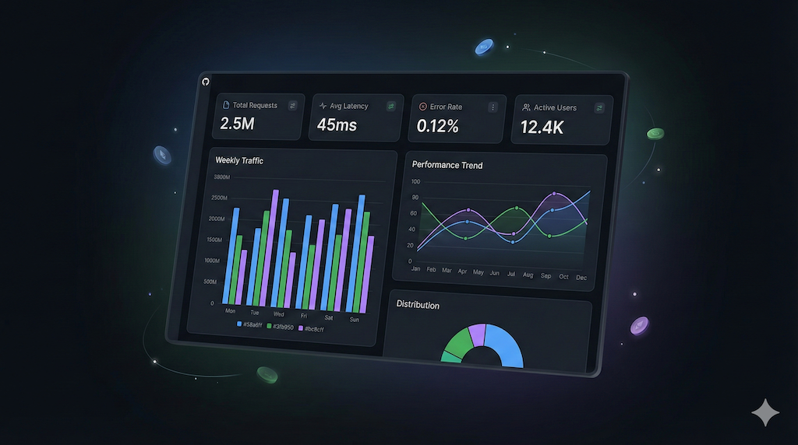
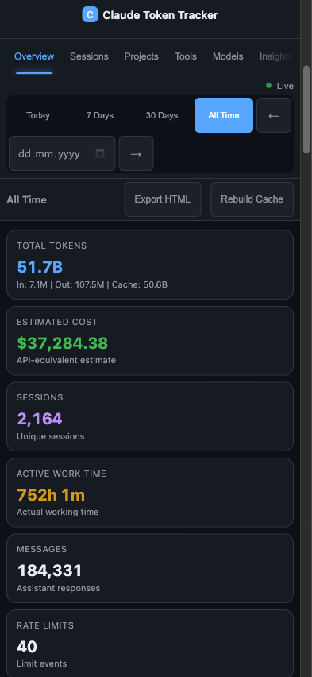
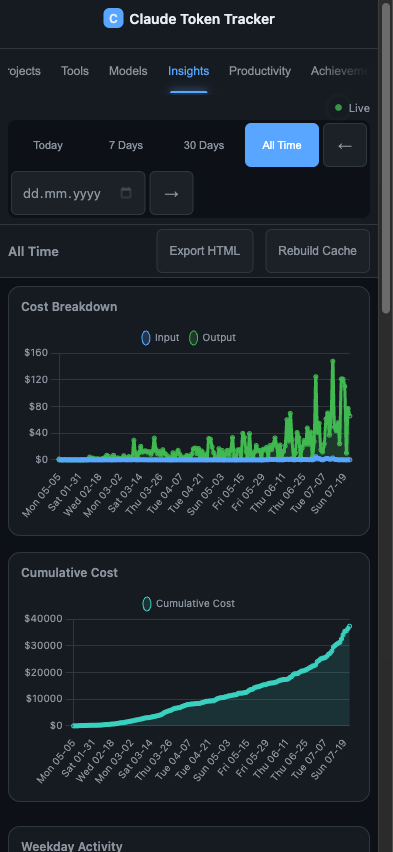
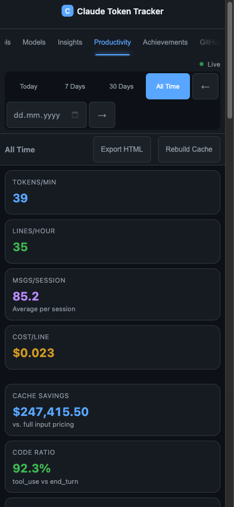
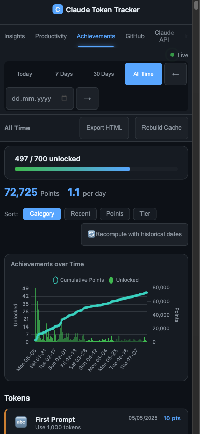

<p align="center">
  <a href="README_DE.md"></a>
</p>

<p align="center">
  <a href="https://github.com/pepperonas/claude-token-tracker/actions/workflows/ci.yml"></a>
  <a href="LICENSE"></a>
  <a href="https://github.com/pepperonas/claude-token-tracker/releases"></a>
  <a href="https://github.com/pepperonas/claude-token-tracker/pulls"></a>
  <a href="https://tracker.celox.io"></a>
</p>

<p align="center">
  = 18">
  
  
  
  
</p>

<p align="center">
  
  
  
  
  
</p>

<p align="center">
  
  
  
  
  
</p>

<p align="center">
  
  
  
  
</p>

<p align="center">
  
  
  
  
  
</p>

<p align="center">
  
  
  
  
  
</p>

<p align="center">
  <a href="https://www.paypal.com/donate/?business=martinpaush@gmail.com&currency_code=EUR"></a>
</p>

---

<p align="center">
  
</p>

# Claude Token Tracker

Dashboard for analyzing your Claude Code token usage. Reads Claude Code's JSONL session files, estimates API-equivalent costs, tracks lines of code, and displays everything in real-time. Supports **single-user** (local) and **multi-user** (hosted with GitHub OAuth + Sync Agent).

> **Note on costs:** Claude Code is billed as a flat-rate subscription (Pro/Max plan), not per token. The costs shown in this dashboard are **API-equivalent estimates** — they show what your token usage would cost at standard Anthropic API rates. This is useful for understanding relative usage patterns, comparing efficiency across sessions, and seeing the value you get from your subscription.

## Features

### Dashboard & Visualization

- **25+ interactive charts** across 10 tabs (Overview, Sessions, Projects, Tools, Models, Insights, Productivity, Achievements, GitHub, Claude API, Info)
- **Tool Cost Attribution** — proportional cost/token distribution per tool, MCP server breakdown (auto-detected via `mcp__` prefix), sub-agent tracking (via `/subagents/` path), cost-over-time chart, enhanced table with Type/Cost/Tokens columns
- **Active sessions** — live display of currently running Claude Code sessions with project, model, duration, and cost
- **Token breakdown** — detail KPI cards for input, output, cache read, and cache create tokens with individual costs
- **Active Work Time** — actual working time (wall-clock) computed from a unified message timeline within the period (gaps > 5 min counted as breaks). Additional "Avg Work Time/Day" KPI divides by days with actual activity (not by period length) — for a 30-day filter with only 15 active days, divisor is 15
- **Lines of Code** — Write (green), Edit (yellow), Delete (red) with Net Change calculation and adaptive hourly/daily chart
- **Global period filter** — Today / 7 Days / 30 Days / All Time with prev/next navigation arrows, applies to all tabs
- **Database download** — download the full SQLite database from Settings for local backup or analysis
- **Sortable tables** — all data tables sortable by clicking column headers
- **Project Detail Dialog** — click any project in chart or table to open a detail modal with 6 KPIs (tokens, cost, sessions, messages, total time, net lines), daily token chart, model distribution doughnut, top tools, sessions list, and JSON export to clipboard
- **CSS-only tooltips** with explanations on KPI labels and chart titles
- **Chart legend persistence** — legend selections and period filter persist in localStorage
- **Mobile-responsive** — optimized for phones (393px+) with touch targets, adaptive charts, and compact layout
- **Bilingual UI** (German / English) with tab, period, and settings persistence

### GitHub Integration

- **GitHub tab** — connect via Personal Access Token to display GitHub-specific analytics
- **Stale-while-revalidate caching** — cached data served instantly (even if stale), background refresh with duplicate-fetch prevention. 60-min TTL, manual refresh button available. After first load, GitHub tab never shows a spinner
- **Billing overview** — Actions minutes, Packages, Storage with Free/Pro plan detection, progress bars, and percentage display
- **Code Statistics** — LOC added/deleted/net aggregated across top 10 repos via GitHub Code Frequency API, period-filtered
- **PR Code Impact** — total additions (green), deletions (red), net lines, and changed files across all PRs with grouped bar chart by PR state (Merged/Open/Closed). Shows "total" hint when period filter is active (PR data cannot be filtered by date)
- **Actions Usage by Repository** — horizontal bar chart showing billable minutes per repo (top 15), workflow-level breakdown table with OS billing multipliers (Ubuntu 1x, macOS 10x, Windows 2x)
- **Minutes by Runner OS** — doughnut chart showing Actions minutes distribution across Ubuntu, macOS, and Windows runners
- **Contributions & Repos** — contribution heatmap (always full year), commit chart and KPIs filtered by selected period
- **Lazy loading** — fast data (stats + billing) renders immediately, slow data (actions usage, code stats) loads in background
- **Smooth refresh** — period changes and refresh button update data in-place without spinner or scroll jump

### Claude API Integration

- **Anthropic Admin API dashboard** — connects via Admin Key (`sk-ant-admin`) to display organization-level usage and cost data from the Anthropic API
- **4 KPIs** — Total Cost, Total Tokens, Avg Cost/Day (on active days), Cache Efficiency (cache-read share)
- **Budget tracking** — set a monthly budget with progress bar, color-coded thresholds (green < 70%, orange < 90%, red >= 90%)
- **Daily cost chart** — stacked bar chart of daily costs broken down by model (Opus, Sonnet, Haiku)
- **Daily token chart** — stacked bar chart of daily tokens by type (Input, Output, Cache Read, Cache Create)
- **Model distribution** — doughnut chart showing cost share per model
- **Cumulative cost trend** — line chart tracking running total over time
- **Per-API-key cost breakdown** — horizontal stacked bar chart showing calculated cost per API key, broken down by model. Costs computed via `lib/pricing.js` model rates (the Anthropic cost API doesn't support `group_by api_key_id`)
- **Daily cost timeline per key** — stacked bar chart showing daily cost per API key over time
- **API key comparison table** — sortable table with columns: Key Name, Tokens, Input, Output, Cache %, Calculated Cost, Last Used
- **Token history per key** — stacked area chart of daily tokens per key (only shown when more than one key has data)
- **Key name resolution** — API key IDs resolved to human-readable names via `/v1/organizations/api_keys`, with truncated ID fallback
- **AES-256-GCM encryption** — Admin keys stored encrypted in the database, never returned in plain text
- **Stale-while-revalidate caching** — API responses cached with configurable TTL (`ANTHROPIC_CACHE_TTL_MINUTES`, default 60 min), manual refresh button with cache age display
- **Period filtering** — all daily charts and KPIs respect the global period filter (Today / 7d / 30d / All Time)
- **Multi-user support** — each user stores their own Admin Key; in single-user mode, key can be set via `.env` or in Settings

### Data Processing

- **Incremental parsing** — only new data is processed (byte-offset tracking)
- **SQLite database** with WAL mode for persistent storage and fast queries
- **In-memory aggregation** — pre-computed maps for fast API responses, incremental cache updates on sync (no full rebuild)
- **Real-time updates** via Server-Sent Events (animation-free on live updates)
- **API-equivalent cost estimation** for all Claude models (Opus 4.5/4.6, Sonnet 4.5, Haiku 4.5, Sonnet 3.7) — shows what your usage would cost at standard API rates, not actual billing (Claude Code uses a flat subscription)
- **Automatic backups** (configurable, e.g. to Google Drive)

### Multi-User & Deployment

- **Multi-device tracking** — track usage across multiple machines (MacBook, VPS, Desktop), per-device API keys, device switcher in dashboard, aggregated "All Devices" view, click-to-rename devices, OS-selectable install commands
- **Multi-user mode** — GitHub OAuth, personal API keys, per-user data isolation
- **Sync Agent** — one-click install via curl (macOS/Linux) or PowerShell (Windows), watches local session files and uploads to server
- **Autostart** — install script automatically sets up launchd (macOS), systemd (Linux), or Task Scheduler (Windows)
- **SEO-optimized** with Open Graph, Twitter Cards, and structured meta tags
- **CI/CD pipeline** with GitHub Actions (lint + tests)
- **Demo mode** — non-logged-in visitors see sample data dashboard; sign in with GitHub to view your own data
- **700 achievements** — gamification system across 14 categories (tokens, sessions, messages, cost, lines, models, tools, time, projects, streaks, cache, special, efficiency, ratelimits) with 5 tiers (bronze to diamond), tier-based points (10–250), timeline chart, daily unlock stats, and real-time unlock notifications via SSE
- **Productivity tab** — Tokens/Min, Lines/Hour, Cost/Line, Cache Savings, Code Ratio with trend indicators
- **Period comparison** — always-visible inline pill selector (Off / Prev. Period / Last 7d / 30d / 90d / Custom) instantly compares two periods side-by-side with 8 metrics (Tokens/Min, Lines/Hour, Cost/Line, Tokens/Line, Lines/Turn, Tools/Turn, I/O Ratio, Coding Hours), delta percentages, and color-coded improvement/regression indicators — one click to activate, no toggle needed
- **HTML export** — mobile-responsive interactive snapshot with Chart.js, 8 tabs (Overview, Charts, Sessions, Projects, Models, Tools, Productivity, Achievements), 12+ charts, and sortable tables. Optimized for phones (412px+) with adaptive layouts, touch-friendly tabs, and responsive chart rendering
- **Global comparison** — compare your stats against the average of all users (multi-user mode)
- **151 automated tests** (unit + integration + multi-user API + achievements)

## Mobile Screenshots (iPhone 16 — 393px)

| | | | |
|---|---|---|---|
|  |  |  |  |
| **Overview** | **Insights** | **Productivity** | **Achievements** |

## Architecture

```
Single-User:
  ~/.claude/projects/**/*.jsonl
      -> Parser (incremental, byte-offset)
      -> SQLite (WAL, 10 tables, INSERT OR REPLACE)
      -> Aggregator (in-memory, pre-computed maps)
      -> HTTP Server (50+ JSON endpoints + SSE)
      -> Frontend (Chart.js, i18n DE/EN, sortable tables)

Multi-User:
  Sync Agent (client) -> POST /api/sync (API key auth)
      -> SQLite (per user, user_id)
      -> AggregatorCache (lazy, incremental sync, 30min eviction)
      -> HTTP Server (GitHub OAuth + session cookies)
      -> Frontend (login overlay, sync setup, active sessions)
```

### Module Overview

| Module | Description |
|--------|-------------|
| `lib/parser.js` | Reads JSONL files, extracts token counts, tools (with per-tool call counts), model, lines-of-code, and sub-agent flag from `type: 'assistant'` messages |
| `lib/aggregator.js` | In-memory analytics engine with `_daily`, `_sessions`, `_projects`, `_models`, `_tools`, `_hourly`, `_toolStats`, `_mcpServers`, `_subagentStats` maps. `AggregatorCache` supports incremental updates via `addToUser()` to avoid full rebuilds on sync |
| `lib/db.js` | SQLite layer with `messages`, `message_tools`, `parse_state`, `metadata`, `users`, `user_sessions`, `achievements`, `github_cache`, `rate_limit_events`, `devices` tables. Compound indexes for multi-user/device queries |
| `lib/pricing.js` | Model pricing (input/output/cacheRead/cacheCreate per 1M tokens) |
| `lib/watcher.js` | Chokidar file watcher with debounced incremental parsing |
| `lib/auth.js` | GitHub OAuth flow, session management, cookie-based authentication |
| `lib/backup.js` | SQLite `VACUUM INTO` for atomic backups, auto-pruning to 10 copies, 50% size safety check |
| `lib/achievements.js` | 700 achievement definitions with check logic, stats builder, tier-based points, and unlock tracking |
| `lib/github.js` | GitHub API integration (REST + GraphQL), billing via usage summary API, PR stats, contributions, code stats, actions usage per repo with OS multipliers, stale-while-revalidate cache (60-min TTL) |
| `lib/anthropic-api.js` | Anthropic Admin API integration — usage/cost reports, per-API-key breakdown (4 parallel requests: usage by model, usage by key+model, cost report, API key names), SWR cache, AES-256-GCM key encryption |
| `lib/export-html.js` | Mobile-responsive HTML snapshot generator with Chart.js, 8 tabs, 12+ charts, sortable tables, and responsive breakpoints (768px/480px/412px) |
| `server.js` | Vanilla `http.createServer` with 50+ API routes, SSE, and static file serving |
| `sync-agent/` | Standalone CLI tool for client-side watching and uploading |

## Installation

```bash
git clone https://github.com/pepperonas/claude-token-tracker.git
cd claude-token-tracker
npm install
npm start
```

Open dashboard: [http://localhost:5010](http://localhost:5010)

## Configuration

Create a `.env` file (optional for single-user, required for multi-user):

### General

| Variable | Default | Description |
|----------|---------|-------------|
| `PORT` | `5010` | Server port |
| `CLAUDE_DIR` | `~/.claude` | Path to Claude directory |
| `DB_PATH` | `data/tracker.db` | Path to SQLite database |
| `BACKUP_PATH` | *(empty)* | Destination directory for automatic backups |
| `BACKUP_INTERVAL_HOURS` | `6` | Backup interval in hours |
| `GITHUB_TOKEN` | — | GitHub Personal Access Token (for GitHub tab) |

### Multi-User Mode

| Variable | Default | Description |
|----------|---------|-------------|
| `MULTI_USER` | `false` | Enable multi-user mode |
| `BASE_URL` | `http://localhost:PORT` | Public URL (for OAuth redirect) |
| `GITHUB_CLIENT_ID` | — | GitHub OAuth App Client ID |
| `GITHUB_CLIENT_SECRET` | — | GitHub OAuth App Client Secret |
| `SESSION_SECRET` | — | Secret key for sessions |

## Lines of Code

The tracker automatically captures code line changes from JSONL session files:

- **Write** (green) — lines in `content` from Write tool calls (new files / overwrites)
- **Edit** (yellow) — lines in `new_string` from Edit tool calls (replacement text)
- **Delete** (red) — lines in `old_string` from Edit tool calls (removed text)

**Net Change** = write + edit - delete

The data is displayed as:
- **KPI cards** in the overview (Write, Edit, Delete, Net Change)
- **"+/-" column** in the Sessions and Projects tables
- **Daily bar chart** in the Insights tab (green = Write, yellow = Edit, red = Delete)

> After a **Cache Rebuild**, all historical files are re-parsed and lines data is populated.

## Multi-User Mode

Multi-user mode allows multiple people to track their token data on a central server.

1. **Create a GitHub OAuth App** at [github.com/settings/developers](https://github.com/settings/developers)
   - Authorization callback URL: `https://your-domain.com/auth/github/callback`
2. **Configure `.env`** with OAuth credentials and `MULTI_USER=true`
3. **Start the server** — GitHub login appears automatically

Each user gets a personal **API key** for the Sync Agent, visible in the Info tab.

### Differences from Single-User Mode

| Aspect | Single-User | Multi-User |
|--------|-------------|------------|
| Data source | Local JSONL files (Chokidar watcher) | Sync Agent uploads via API |
| Authentication | None | GitHub OAuth + session cookies |
| Data isolation | None (all data belongs to one user) | Per-user via `user_id`, per-device via `device_id` |
| Aggregation | One global aggregator | AggregatorCache (per-user, per-device, incremental sync updates, 30min eviction) |
| File watcher | Active | Disabled |

## Sync Agent

The Sync Agent runs on the user's machine and automatically uploads local Claude Code session data to the server.

### One-Click Install (recommended)

1. Log into the dashboard -> Info tab -> **Sync Agent Setup**
2. Select your OS (macOS/Linux or Windows)
3. Copy the displayed command or download the install script

**macOS / Linux:**
```bash
curl -sL "https://your-domain.com/api/sync-agent/install.sh?key=YOUR_API_KEY" | bash
```

**Windows (PowerShell):**
```powershell
powershell -ExecutionPolicy Bypass -Command "irm 'https://your-domain.com/api/sync-agent/install.ps1?key=YOUR_API_KEY' | iex"
```

The script:
- Checks Node.js >= 18 and npm
- Installs the agent to `~/claude-sync-agent/` (macOS/Linux) or `%USERPROFILE%\claude-sync-agent\` (Windows)
- Configures API key and server URL automatically
- Verifies server connectivity
- Sets up autostart (launchd on macOS, systemd on Linux, Task Scheduler on Windows)
- Starts the agent immediately

### Manual Installation

```bash
cd sync-agent
npm install
node index.js setup    # Enter server URL and API key
node index.js          # Start (full sync + watch)
```

### Autostart with PM2 (alternative)

```bash
pm2 start ~/claude-sync-agent/index.js --name claude-sync
pm2 save
```

### How It Works

| Property | Value |
|----------|-------|
| File watcher | Chokidar 4.x with `awaitWriteFinish` debouncing, path-based ignore function (compatible with full-path matching) |
| Parsing | Incremental (byte-offset, new data only) |
| Batch size | Max 500 messages per request |
| Retry | Exponential backoff (3 attempts) |
| Response time | ~600ms after each Claude response |
| State | Persisted in `.sync-state.json` |
| Heartbeat | Logs status every 30 minutes |
| Error handling | FSEvents error recovery, unhandled rejection guard |

## Active Sessions

The Overview tab displays currently active Claude Code sessions live (green section above the KPI cards). A session is considered active if its last message was within the past 10 minutes. Each session shows project, model, duration, messages, and cost. The display updates automatically via SSE — without chart animations.

## Backup

| Method | Command |
|--------|---------|
| Automatic | Set `BACKUP_PATH` in `.env` (e.g. Google Drive) |
| Manual | `curl -X POST http://localhost:5010/api/backup` |
| JSON export | `curl http://localhost:5010/api/export > export.json` |

- Backups are created on startup and at the configured interval
- Maximum 10 backup copies (older ones are automatically deleted)
- Atomic backup via SQLite `VACUUM INTO`
- Safety check: rejects backups smaller than 50% of last backup to prevent saving corrupt/empty databases

## Deployment

Example deployment with PM2 + Nginx + SSL:

```bash
# On the server
git clone https://github.com/pepperonas/claude-token-tracker.git
cd claude-token-tracker
npm ci --production
cp .env.example .env   # Configure
pm2 start server.js --name token-tracker --node-args='--env-file=.env'
pm2 save
```

Nginx reverse proxy with SSL (certbot) recommended for multi-user mode.

### Hosted Version

The tracker runs in production at [tracker.celox.io](https://tracker.celox.io).

## API Endpoints

| Endpoint | Method | Description |
|----------|--------|-------------|
| `/api/overview` | GET | KPI data (tokens, cost, sessions, messages, lines) |
| `/api/daily` | GET | Daily aggregates (tokens, cost, lines) |
| `/api/sessions` | GET | All sessions with filters (project, model, period) |
| `/api/projects` | GET | Project statistics |
| `/api/models` | GET | Model statistics |
| `/api/tools` | GET | Tool usage statistics |
| `/api/tool-stats` | GET | Tool cost attribution (cost, tokens, type per tool) |
| `/api/mcp-servers` | GET | MCP server breakdown with per-tool stats |
| `/api/subagent-stats` | GET | Sub-agent message/token/cost statistics |
| `/api/tool-cost-daily` | GET | Daily tool cost breakdown (top tools over time) |
| `/api/hourly` | GET | Hourly activity |
| `/api/daily-by-model` | GET | Daily tokens by model |
| `/api/daily-cost-breakdown` | GET | Daily cost by token type |
| `/api/cumulative-cost` | GET | Cumulative cost |
| `/api/day-of-week` | GET | Weekday activity |
| `/api/cache-efficiency` | GET | Daily cache hit rate |
| `/api/stop-reasons` | GET | Stop reason distribution |
| `/api/session-efficiency` | GET | Tokens/message and cost/message |
| `/api/active-sessions` | GET | Active sessions (last 10 min) |
| `/api/achievements` | GET | All 700 achievements with unlock status |
| `/api/productivity` | GET | Productivity metrics (tokens/min, lines/hour, cost/line, trends) |
| `/api/export-html` | GET | Interactive HTML snapshot (Chart.js, 8 tabs, 12+ charts) |
| `/api/github/stats` | GET | GitHub contributions, repos, PRs (requires token) |
| `/api/github/billing` | GET | GitHub billing info (Actions minutes, Packages, Storage) |
| `/api/github/code-stats` | GET | Aggregated LOC stats across top repos |
| `/api/github/actions-usage` | GET | Actions usage per repository with workflow breakdown |
| `/api/github/refresh` | POST | Force refresh GitHub data cache |
| `/api/anthropic/dashboard` | GET | Anthropic API usage/cost dashboard with per-key breakdown |
| `/api/anthropic/budget` | GET/POST | Get or set monthly budget |
| `/api/anthropic/refresh` | POST | Force refresh Anthropic data cache |
| `/api/rate-limits` | GET | Rate-limit event statistics (total, daily) |
| `/api/devices` | GET/POST | List or create devices (multi-user) |
| `/api/devices/:id` | PUT/DELETE | Rename or delete a device |
| `/api/devices/:id/regenerate-key` | POST | Regenerate device API key |
| `/api/global-averages` | GET | Personal vs average stats (multi-user) |
| `/api/rebuild` | POST | Rebuild cache |
| `/api/backup` | POST | Create manual backup |
| `/api/export` | GET | Full JSON export |
| `/api/sync` | POST | Sync messages (multi-user) |
| `/api/live` | GET | SSE stream for real-time updates |

All GET endpoints support `?from=YYYY-MM-DD&to=YYYY-MM-DD` query parameters. Analytics endpoints also support `?device=ID` for per-device filtering (multi-user mode).

## Development

```bash
npm test              # Run all 151 tests (vitest)
npm run test:watch    # Watch mode
npm run test:coverage # Coverage report
npm run lint          # ESLint (lib/ + server.js)
```

### Tech Stack

| Component | Technology |
|-----------|------------|
| Backend | Node.js (vanilla `http`, no Express) |
| Database | SQLite via `better-sqlite3` (WAL mode) |
| Frontend | Vanilla JS, Chart.js 4.x, CSS Custom Properties |
| File watcher | Chokidar 4.x |
| Tests | Vitest + Supertest |
| Linting | ESLint 9 (flat config) |
| CI/CD | GitHub Actions |
| Deployment | PM2 + Nginx + certbot |

### Conventions

- CommonJS backend (`require`/`module.exports`)
- Timestamps: ISO 8601, dates as `YYYY-MM-DD`
- Token counts: always integers, default 0
- Costs: rounded to 2 decimal places
- Unused variables: prefix `_` (ESLint)

## Better Together: OPS Integration

[OPS](https://github.com/pepperonas/celox-ops) is a business management app for freelancers and IT consultants. Combined with the Token Tracker, AI usage data flows directly into customer management:

- Customers see interactive dashboards with active work time, cost, and code lines
- AI usage reports can be attached to invoice PDFs
- CSV and HTML export for transparent client communication

[OPS on GitHub](https://github.com/pepperonas/celox-ops)

## Author

Built by [Martin Pfeffer](https://celox.io) | [GitHub](https://github.com/pepperonas)

## License

MIT — see [LICENSE](LICENSE)

---

<p align="center">
  <b>If you find this project useful, consider supporting its development:</b>
</p>

<p align="center">
  <a href="https://www.paypal.com/donate/?business=martinpaush@gmail.com&currency_code=EUR"></a>
</p>
